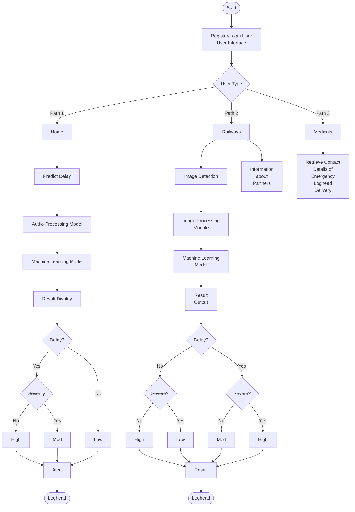

# Delay-Order Project Flowchart

## System Architecture Flow

## Process Description

### 1. User Authentication
- System starts with user registration/login interface
- Users authenticate to access the system

### 2. Main Branches

#### **Home Path - Audio-based Delay Prediction**
- **Predict Delay**: Initiates delay prediction process
- **Audio Processing Model**: Processes audio input data
- **Machine Learning Model**: Analyzes patterns to predict delays
- **Result Display**: Shows prediction results
- **Decision Logic**:
  - Checks if delay exists (Yes/No)
  - Evaluates severity level
  - Categorizes as: Low, Moderate (Mod), or High
  - Triggers alert notifications
  - Logs to system (Loghead)

#### **Railways Path - Image-based Detection**
- **Image Detection**: Captures railway-related images
- **Image Processing Module**: Processes visual data
- **Machine Learning Model**: Analyzes images for delays
- **Information about Partners**: Provides partner details
- **Result Output**: Generates analysis results
- **Decision Logic**:
  - Determines delay presence
  - Assesses severity
  - Classifies priority level
  - Records results

#### **Medicals Path - Emergency Contact System**
- **Retrieve Contact Details**: Accesses emergency logistics contacts
- Manages delivery coordination for critical medical supplies
- Handles emergency loghead delivery information

### 3. Output & Logging
- All paths converge to **Loghead** logging system
- Results stored for analysis and reporting
- Alerts sent to relevant stakeholders

## Key Features

- **Multi-modal Analysis**: Supports both audio and image-based delay detection
- **Severity Classification**: Three-level priority system (Low, Moderate, High)
- **Emergency Handling**: Dedicated medical logistics pathway
- **Partner Integration**: Railway partner information system
- **Automated Alerts**: Real-time notification system
- **Comprehensive Logging**: Complete audit trail via Loghead system

## Technology Stack

- **Machine Learning**: Delay prediction and pattern recognition
- **Audio Processing**: Voice/sound analysis for delay detection
- **Image Processing**: Visual analysis for railway operations
- **User Management**: Authentication and authorization system
- **Logging System**: Centralized logging (Loghead)

---

*This flowchart represents the complete architecture of the delay-order delivery analysis system.*
